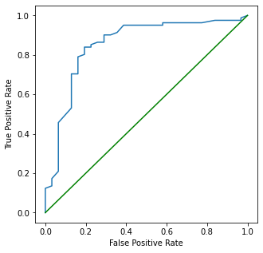

# anilist-ml

Learning the basics of machine learning with Anilist data

## Summary

I originally set out to make a model trained on my Anilist data that was able
to predict the score (1-10) that I would probably give an anime.

At first I tried to make a regression model. I realized since I was only rating 1-10
I would probably have more accuracy using a classifier model. Classifier models were definitely more accurate.
But, the best I was able to pull off was a random forest classifier with an accuracy of ~38%.

I think my data is subpar since I only have ~500 data points and generally skewed data.
I tend to give an anime a score of 7 more than anything else and also tend to not be very critical.
So, entries with a score below 5 are very rare and I think it makes training more difficult.

After messing around for a while I decided to switch to a binary classification and change my target.
Would I recommend or not recommend an anime?
With this change, my final result was a random forest classifier with an accuracy of ~84-85%.

Someone knowledgeable in machine learning could probably point out what I was doing wrong immediately.
But, oh well this was my first ML project and I have a lot to learn. 
This wasn't exactly a win, but hopefully the next ML project goes better.

## Results

The final model is located in [model.ipynb](model.ipynb).

```txt
Log loss = 4.934196584711905
ROC AUC Score = 0.8524492234169653

Confusion Matrix:
[[19 12]
 [ 4 77]]

Classification Report:
              precision    recall  f1-score   support

       False   0.826087  0.612903  0.703704        31
        True   0.865169  0.950617  0.905882        81

    accuracy                       0.857143       112
   macro avg   0.845628  0.781760  0.804793       112
weighted avg   0.854351  0.857143  0.849922       112
```

ROC Plot



### Notebooks

1. [fetch.ipynb](fetch.ipynb) - Fetches user and anime data using Anilist's GraphQL API.
2. [clean.ipynb](clean.ipynb) - Cleans fetched data to prepare for data visualization and model training.
3. [explore.ipynb](explore.ipynb) - Some data visualizations and general exploration of data.
4. [model-select-reg.ipynb](model-select-reg.ipynb) - Testing out different regression models.
5. [model-select-cls.ipynb](model-select-cls.ipynb) - Testing out different classifier models.
6. [model.ipynb](model-final.ipynb) - Final model training, verification, and evaluation.

## Data

- fetched
  - [data/anime-YYYYMMDD-raw.csv](data/anime-20220927-raw.csv) - raw Anilist anime data
  - [data/user-YYYYMMDD-raw.csv](data/user-20220927-raw.csv) - raw Anilist user data
- cleaned/enriched
  - [data/anime-YYYYMMDD-clean.csv](data/anime-20220927-clean.csv) - cleaned anime data; usesless columns dropped and missing data filled
  - [data/user-YYYYMMDD-clean.csv](data/user-20220927-clean.csv) - cleaned user data; useless columns dropped
  - [data/user-YYYYMMDD-enriched.csv](data/user-20220927-enriched.csv) - user data joined with anime data
- regression
  - [data/user-YYYYMMDD-reg-train.csv](data/user-20220927-reg-train.csv) - train data for regression models
  - [data/user-YYYYMMDD-reg-valid.csv](data/user-20220927-reg-valid.csv) - validation data for regression models
  - [data/user-YYYYMMDD-reg-test.csv](data/user-20220927-reg-test.csv) - test data for regression models
- classification
  - [data/user-YYYYMMDD-cls-train.csv](data/user-20220927-cls-train.csv) - train data for classifier models
  - [data/user-YYYYMMDD-cls-valid.csv](data/user-20220927-cls-valid.csv) - validation data for classifier models
  - [data/user-YYYYMMDD-cls-test.csv](data/user-20220927-cls-test.csv) - test data for classifier models

I also made the Anilist anime data (as of 09/27/2022) available on 
[Kaggle](https://www.kaggle.com/datasets/barrettotte/anilistanimedata).

## References

- [Anilist Interactive GraphQL Tool](https://anilist.co/graphiql)
- [Anilist GraphQL Documentation Explorer](https://anilist.github.io/ApiV2-GraphQL-Docs/)
- [Coursera Machine Learning Specialization (Andrew Ng)](https://www.coursera.org/specializations/machine-learning-introduction)
- [Hands-On Machine Learning with Scikit-Learn, Keras & TensorFlow. Geron](https://www.amazon.com/Hands-Machine-Learning-Scikit-Learn-TensorFlow/dp/1492032646)
